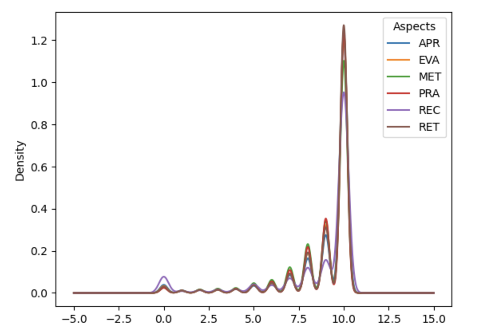

(In english because I want to reuse information of these summary to present on the seminary)
## Summary

The ECOA SET is currently evaluating professors teaching quality over each curse by taking into account some of the quantitative data that is obtained from the students submission of the ECOA.

It has been shown (_add reference_) that the 'halo effect' is present in the SETs and thus, it is giving bad quality information about the feedback that the student is giving to the professor.

The ECOA, allow the student to evaluate the professor on different aspects, these aspects are evaluating using a 0-10 (11-Point scale) for each aspect. However, not all aspects seem relevant to the institution and only some of them are truly relevant and representative to assess the professor. In particular one of these aspects is of interest: **REC**, which is the evaluation to the questions **'Would you recommend this professor?'**.

*Hypothesis*:  REC aspect is not sufficient to evaluate the professor and this numerical evaluation is biased by the 'halo effect'.

But, can we prove that the REC aspect is not predictable using the other aspects considered in the ECOA?. Is there another source of information that could help us measure if REC is representative of the student opinion?.

NLP can help us to get information from another source in the ECOA: the comments. We can use the comments to create embedding for the questions in the ECOA and the comments to understand the relationship between the numerical part of the survey and the written section.

One type of data that we can obtain from analyzing the relationship between the questions that are asked to evaluate the aspects and the comments is the *Cosine Similarity*. 

$cos(θ) = A ⋅ B /(||A||  ||B||)$

Cosine will be the similarity between the two vectors A(Question) and B (Answer). We 
can use this new similarity matrix to produce modifications in the aspects evaluated and experiment if the element-wise multiplication (*numpy.multiply*) of these two arrays help the models in some way. We will call this cosine similarity matrix '**aspects opacity**'.

A hypothesis is considered to be falsifiable if it can be tested in such a way that it could be proven false. This statement open the space for the experimentation process to respond to the following questions that could help us prove false or true the hypothesis.

- Is it possible to classify if REC will be positive or negative using only the other five aspects? (Experiment 1)
- Is it possible to classify if REC will be positive or negative using aspects opacity scores obtained from the cosine similarity between question and comment? (Experiment 2)
- Can we classify if REC will be positive or negative using BERT? (Experiment 3)
- Are there any other aspects that are easier to classify using the comments (in ether TF-IDF and ML models or BERT)?

# Experiments
### Experiment 1

To answer the **first question** we will train a SVM model and we will use the following scale to determine if the evaluation is positive or negative.

`Use the scales (0 if Aspect is < 8,  1 if Aspect is >= 8)            scales = [0, 7.9, 0], [8, 10, 1]`

This means that from 0 to 7.9 we will consider the comment as negative, and from 8 to 10 we will consider it positive.

But first, the reasoning of this scale is because the distribution of the scores where very imbalanced and this scale allow us to have a more or less balanced dataset with both positive and negative scores.

The initial distribution of the aspects scores:
.
Using the scale 0 to 7.9 = negative, 8 to 10 = positive returns this distribution:
.

The first experiment model's classification report is shown below.

.
The results were good, but we have to remember that this models is trained using only the numerical evaluation of the aspects to classify another aspect: REC. We could conclude with these results that it is possible to predict with high accuracy the REC aspect if we use the other scores from the ECOA. Which is not a rare statement if we consider the correlation between them:

.

**But can we do the same using data from the comments?** 

### Experiment 2.1 (Aspects Opacity)

The first information obtained from the comments that we are going to use is the cosine similarity or as we call it, the 'aspects opacity'. This new matrix allow us to put in front of the same aspects as before, but using the similarity between question and answer (comment). The new matrix is expected to be more 'fair' or representative of the aspect scored in relation with the comment submitted.

To clarify, if the comment is talking about the methodology used by the professor, we could give more weight to that aspect's score, in that case the 'MET' score. 

Using the opacity in the aspects results in a distribution like this:
.

The mean of the REC aspect in this case is **2.1**. We are not going to apply any scale in this new distribution, we will use these new 'weighted' aspects to perform a similar experiment as before, we will try to classify REC using a SVM.

.
We can see that it is much more harder to the SVC model to classify the negative REC scores. This is good results to us because it get us closer to prove that REC isn't representative of the students opinion. This experiment is not enough to declare that statement as true.  

### Experiment 2.2 (TF-IDF only)

This experiment was already done using only the TF-IDF representation of the comment to 
.

To ensure that the classification of the REC aspect using comments information is enough to confirm that it is not possible to use only REC aspect to evaluate the professor if que are considering the comment we will perform another experiment using BERT.